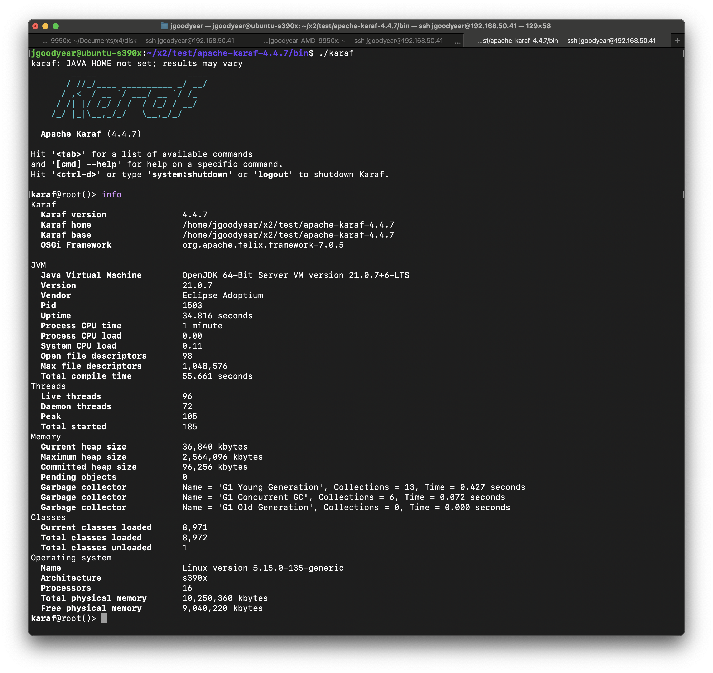

# Setting up a QEMU s390x instance to run Apache Karaf

Setting up a Qemu s390x (IBM Z mainframe architecture) instance to run
Apache Karaf is fun project you can try on your own hardware and
experience using s390x architecture.

For this project we’ll use Ubuntu’s server 22.04 cloud image for s390x.

Note: Our Qemu host runs Ubuntu 24.04 on x64.

## Prerequisites

Ensure the following are installed on your system:

    sudo apt update
    sudo apt install qemu-system-s390x cloud-image-utils

### Step 1: Download Ubuntu 22.04 s390x Cloud Image

Ubuntu provides s390x cloud images:

    wget https://cloud-images.ubuntu.com/releases/22.04/release/ubuntu-22.04-server-cloudimg-s390x.img

This is a pre-installed cloud image meant to boot quickly using
cloud-init.

### Step 2: Create a Cloud-Init ISO (User Data + Meta Data)

Create a folder for cloud-init files:

    mkdir -p cloud-init

Create in this folder `user-data` file.

    #cloud-config
    hostname: ubuntu-s390x
    users:
      - name: ubuntu <chose your own user name>
        ssh-authorized-keys:
          - <your-ssh-public-key>
        sudo: ['ALL=(ALL) NOPASSWD:ALL']
        shell: /bin/bash

Replace \<your-ssh-public-key\> with your actual SSH public key.

Next, create in this folder `meta-data` file.

    instance-id: ubuntu-s390x
    local-hostname: ubuntu-s390x

Create the cloud-init ISO:

    cloud-localds cloud-init.iso cloud-init/user-data cloud-init/meta-data

### Step 3: Launch QEMU with s390x

Run the VM using qemu-system-s390x:

    qemu-system-s390x \
      -m 10240 \
      -cpu max \
      -smp 16 \
      -drive file=ubuntu-22.04-server-cloudimg-s390x.img,format=qcow2,if=virtio \
      -drive file=cloud-init.iso,format=raw,if=virtio \
      -nographic \
      -netdev user,id=net0,hostfwd=tcp::2222-:22 \
      -device virtio-net-pci,netdev=net0

|  |  |
|----|----|
| Command | Description |
| qemu-system-s390x | Qemu system for emulating s390x |
| m | RAM size in Megabytes |
| cpu | max Enables all features supported by the accelerator in the current host |
| smp | number of processor cores |
| drive | sets up files representing disk |
| nographic | No GUI |
| netdev | configures network device (maps host port 2222 to VM port 22) |
| device | configure virtual io |

Note: By default the cloud image will have around 2.2 GB disk available,
if you need more space you can run the following command:

    qemu-img resize ubuntu-22.04-server-cloudimg-s390x.img +2G

### Step 4: Connect via SSH

Once the VM is running, SSH into it using:

    ssh -p 2222 ubuntu@localhost

You’ll authenticate using the SSH key you added in the cloud-init
config.

You man run the `lscpu` command to see details on the emulated CPU.

    $ lscpu
    Architecture:             s390x
      CPU op-mode(s):         32-bit, 64-bit
      Byte Order:             Big Endian
    CPU(s):                   16
      On-line CPU(s) list:    0-15
    Vendor ID:                IBM/S390
      Machine type:           8561

### Step 5: Install Apache Maven and a JDK

As prerequisites to run Apache Karaf we’ll need to install Apache Maven,
and a JDK to the system. We’ll also need to setup our MAVEN_HOME,
JAVA_HOME, and PATH environment variables.

On our s390x Ubuntu system we create a folder to store our
prerequisites.

    mkdir x1
    cd x1
    wget <Apache Maven archieve>
    wget <JDK archive for s390x such as https://adoptium.net/temurin/releases/?os=linux&arch=s390x&package=jdk >
    tar zxf apache-maven-version-bin.tar.gz
    tar zxf jdk.tar.gz

With these prerequisites we setup environment variables. To help
illustrate this setup we can write an env_setup.sh script containing:

    MAVEN_OPTS="-Dmaven.artifact.threads=5"

    MVN_HOME=/home/ubuntu/x1/apache-maven-3.9.9/bin

    JAVA_HOME=/home/ubuntu/x1/jdk-21.0.7+6

    PATH=$MVN_HOME:$JAVA_HOME/bin:$PATH
    export PATH MAVEN_OPTS JAVA_HOME

### Step 6: Install Apache Karaf

We download a tar.gz archive of Apache Karaf from
<https://karaf.apache.org/download>. Extracting the kit, we can enter
the bin folder and run `karaf`.

<figure>

</figure>

# Conclusion

This methodology is NOT for production use, it’s a fun project to
explore using QEMU technology to virtualize and run a s390x based Ubuntu
instance, and try out Apache Karaf running atop of it.

# About the Authors

[Jamie
Goodyear](https://github.com/savoirtech/blogs/blob/main/authors/JamieGoodyear.md)

# Reaching Out

Please do not hesitate to reach out with questions and comments, here on
the Blog, or through the Savoir Technologies website at
<https://www.savoirtech.com>.

# With Thanks

Thank you to the QEMU, Ubuntu, Open Mainframe, and Apache Karaf
communities.

\(c\) 2025 Savoir Technologies
